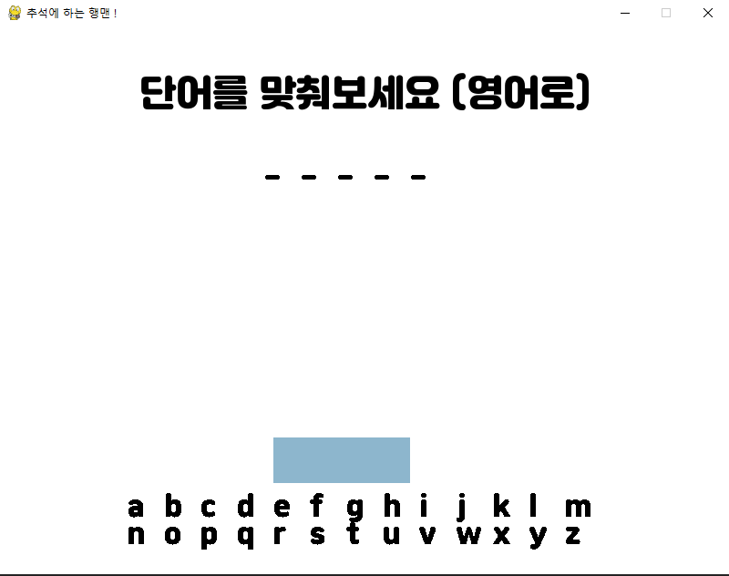

## pygame으로 만든 귀여운 행맨

{: width="300" height="150"}

### 단어는 세가지 중에서 선택

{: width="300" height="150"}

{: width="300" height="150"}

### 실패화면 
{: width="300" height="150"}

### 성공화면
{: width="300" height="150"}
